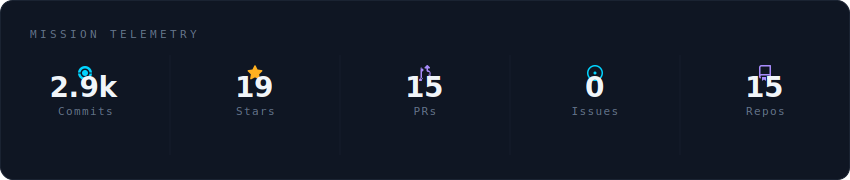

<!-- Galaxy Profile README — gerado a partir do template HerculesSP/HerculesSP -->

  

 

  

 

  

 

  

 

<strong>Mais sobre mim</strong>

 

Formado como Técnico em Informática pelo IFRO, sempre buscando o melhor que posso fazer em tudo que participo.
Atuo com TypeScript, Go e C# em projetos web e APIs, do front ao back.

**Localização:** Ji-Paraná/RO, Brasil

 

  
  
  

