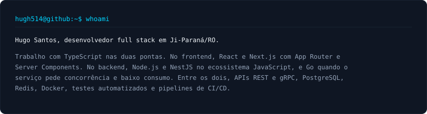
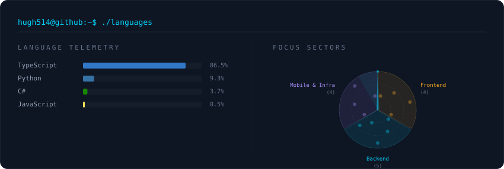
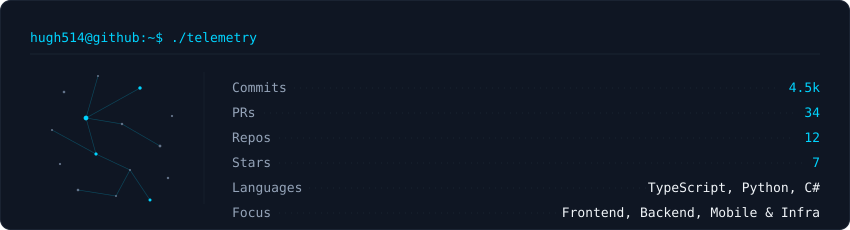

  

 

  

 

  

 

  

 

  

 

  

 

  <a href="https://www.linkedin.com/in/hugo-santos-875bb2245/">LinkedIn</a>
  &nbsp;·&nbsp;
  <a href="mailto:santos.hugh514@gmail.com">santos.hugh514@gmail.com</a>

 

  Os painéis acima saem de um <code>config.yml</code> e são reconstruídos por GitHub Actions.
  Código do gerador em <a href="https://github.com/hugh514/hugh514">hugh514/hugh514</a>.

