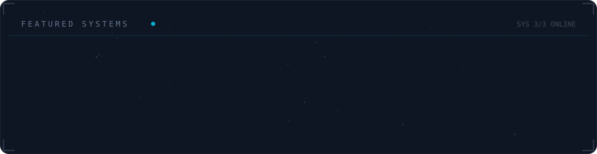

  

## Olá, eu sou o Hugo 👋

Desenvolvedor **Full Stack** em Ji-Paraná/RO. Trabalho num provedor de internet fibra óptica
com **140 mil+ clientes**, onde construo e mantenho produtos web, APIs e aplicativos **em produção**.

No dia a dia vou do **React / Next.js / TypeScript** no frontend ao **Node.js / NestJS** e **Go**
no backend — APIs REST e gRPC, PostgreSQL, Redis, Docker, testes automatizados e CI/CD.

**O que eu já entreguei:**

- Um **backoffice** com 29 módulos de gestão que a empresa usa todos os dias
- Uma **API em Go** com 247 endpoints REST e mais de 180 arquivos de teste
- Um **app mobile** em React Native/Expo publicado nas lojas, com atualizações OTA
- Uma **plataforma de analytics** com pipeline de ingestão MongoDB → PostgreSQL
- Contribuições numa reescrita de ERP em **microserviços Go com gRPC e NATS JetStream**

---

## 🛰️ Projetos em destaque

  

| Projeto | O que é | Stack |
|---|---|---|
| **[api-barbearia](https://github.com/hugh514/api-barbearia)** | API central multi-tenant de uma plataforma de barbearia: RBAC, fila de atendimento, check-in por QR, assinaturas recorrentes, pagamentos e atendimento omnichannel | NestJS · Prisma · PostgreSQL · Redis · BullMQ · Socket.IO · Sentry |
| **[barbearia-backoffice](https://github.com/hugh514/barbearia-backoffice)** | Painel de gestão que consome a API: agenda, fila, planos, clientes e conversas em tempo real | Next.js 16 · React 19 · TanStack Query · Playwright |
| **[barbearia-cliente](https://github.com/hugh514/barbearia-cliente)** | App do cliente: check-in por QR Code, planos e histórico | Next.js 16 · React 19 · Zod |
| **[copy_trading_back](https://github.com/hugh514/copy_trading_back)** | API de plataforma de copy trading com WebSockets e testes de segurança | NestJS · TypeScript · JWT |
| **[copy_trading](https://github.com/hugh514/copy_trading)** | Frontend com autenticação, dashboard e gestão de usuários | Next.js · React · TypeScript |
| **[hugh514](https://github.com/hugh514/hugh514)** | O gerador que desenha este perfil: SVGs criados a partir de um `config.yml`, atualizados por GitHub Actions | Python · GitHub Actions |

---

## 🌌 Stack

  

**Frontend** — TypeScript · React · Next.js (App Router) · Tailwind CSS · TanStack Query/Table/Form · Zod
**Backend** — Node.js · NestJS · Fastify · Go (Gin, GORM) · REST · gRPC/Protobuf · SSE · WebSockets
**Dados** — PostgreSQL · MySQL · MongoDB · Redis · Prisma · Drizzle ORM
**Filas** — BullMQ · NATS JetStream
**Mobile** — React Native · Expo (EAS Build/Update) · Flutter
**Engenharia** — Git · Docker · GitHub Actions · Playwright · Vitest · Jest · Swagger/OpenAPI · Sentry

---

## 📊 Telemetria

  

  

---

## 📫 Contato

**[LinkedIn](https://www.linkedin.com/in/hugo-santos-875bb2245/)** · **[santos.hugh514@gmail.com](mailto:santos.hugh514@gmail.com)**

Aberto a conversas sobre vagas Full Stack (TypeScript / Node.js / React / Go).
